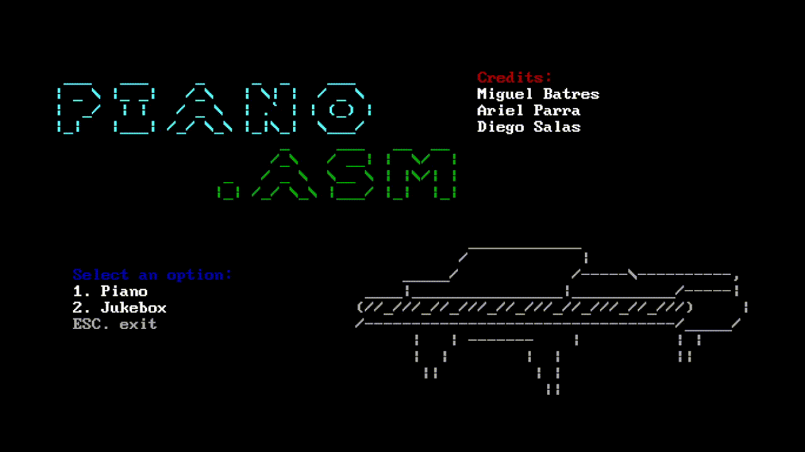

# ASM Piano

ASM Piano is a program written in 8086 Assembly that allows users to play melodies using the computer speaker. It includes a piano mode and a jukebox mode with preloaded songs.



## Installation
The recommended setup is to use the [MASM/TASM extension for Visual Studio Code](https://marketplace.visualstudio.com/items?itemName=xsro.masm-tasm). And following these steps:

1. Install the MASM/TASM extension in Visual Studio Code.
2. Configure the extension to use `MASM-v5.0.0` with DOSBox.
3. Choose the "Workspace" option instead of "Single Files" in the extension settings.

## Compilation
You can compile the program in two ways:

### Using the MASM/TASM Extension
1. Open the `main.asm` file in Visual Studio Code.
2. Right-click anywhere in the file and select **Run ASM Code**. This will compile and execute the program.

### Manual Compilation
1. Open a DOS terminal.
2. Run the following commands:
```asm
MASM MAIN.ASM
LINK MAIN
```

## Execution
To run the program:

1. In the DOS terminal, navigate to the directory containing the compiled `MAIN.EXE` file.
2. Type:


## Legal

## Legal

The melodies included in this program are adaptations of copyrighted works by their respective authors. The code has been modified to attribute the musical notes for educational and non-commercial purposes only. No copyright infringement is intended.

- **Zelda: Song of Time**: Based on code from [raymag/zeldab](https://github.com/raymag/zeldab/blob/main/src/zelda.c)
- **Mario Bros Theme**: Based on code from [cncpp.divilabs.com](https://cncpp.divilabs.com/2013/12/c-code-for-mario-theme-intro-song.html)
- **Despacito**: Based on code from [n3m351d4/SongsForBeeper](https://github.com/n3m351d4/SongsForBeeper/blob/master/Despacito.ino)

